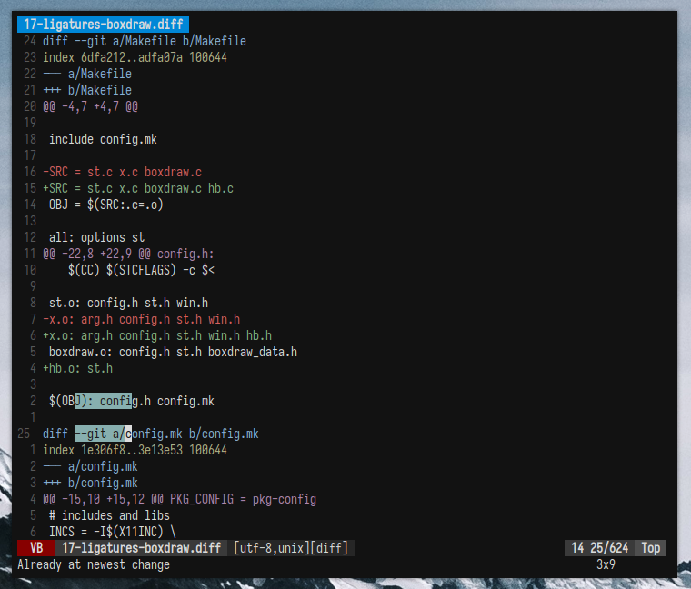

# st-community

A build of the [Suckless Simple Terminal](https://st.suckless.org) (st) with many essential community patches modified to work together.
Targets st revision `9846a56` (a few commits after st version `0.9`), and most likely wont work with other versions without manual changes to the patches.

A single unified patch file with all patches built-in is included as a github releases.
You can apply directly to the st source, as explained below.
If you use Arch Linux, a package is available in the [AUR](https://aur.archlinux.org/packages/st-community-git).
Individual patches used to create it are provided in the `patches/` directory.



## Patches included

- [alpha](https://st.suckless.org/patches/alpha/) _(osc 11)_
- [boxdraw](https://st.suckless.org/patches/boxdraw/) _(enabled by default, except braile)_
- [scrollback](https://st.suckless.org/patches/scrollback/) _(with reflow, mouse, altscreen & mouse increment subpatches, modified to work with boxdraw)_
- [ligatures](https://st.suckless.org/patches/ligatures/) _(boxdraw version)_
- [xresources](https://st.suckless.org/patches/xresources-with-reload-signal/) _(live reload with USR1, modified to also read alpha value)_
- [clipboard](https://st.suckless.org/patches/clipboard/)
- [desktopentry](https://st.suckless.org/patches/desktopentry/)
- [sync](https://st.suckless.org/patches/sync/) _(modified for st 0.9)_
- [copyurl](https://st.suckless.org/patches/copyurl/) _(with multiline)_
- [undercurl](https://st.suckless.org/patches/undercurl/) _(modified to work with previous patches)_
- [openclipboard](https://st.suckless.org/patches/open_copied_url/) _(modified to work with previous patches)_

## Using this build

Download the generated unified patch file from the github releases tab, then clone the st source and apply it by running:
```sh
git clone https://git.suckless.org/st st && cd st
git checkout 9846a56
git am path/to/st-community-xxx-xxx.diff
```
Alternatively, use the provided `patch.sh` script to automatically download the correct revision and apply the patch.
Then, compile st and install it directly from downloaded `st` directory by running:
```
make
make install # Requires root
```

## Configuration

St's main configuration method is by changing hard-coded values in `config.def.h`, and then recompiling the software.
You may do this by manually modifying the source, or by changing `patches/99-config.diff` and reapplying it.

Thanks to the `xresources`, patch some values (like colors and font) can be read from the X resources database (usually at `~/.Xresources`) on the fly.
St will detect any of the following variables if used:

```css
st.colorX            /* Where X is a number in the range [0, 15] */
st.foreground
st.cursorColor
st.reverse-cursor
st.alpha
st.font
st.termname
st.blinktimeout
st.bellvolume
st.borderpx
st.cursorshape
st.csscale
st.shscale
```

When specifying variables like this, they override compile-time configuration.
Remember to run `xrdb -merge ~/.Xresources` after modifying the file, for changes to take effect.
If you have terminal instances already running, you can send them a `USR1` signal to make st hot-reload changes, using something like `kill -USR1 $(pidof st)`.

For example, your `.Xresources` file may look like:

```css
! St specific config
st.font: Iosevka Nerd Font Mono:style=Regular:pixelsize=14:antialias=true:autohint=false
st.borderpx: 6
st.alpha: 1.0

! Global config
*.foreground:  #dcdcdc
*.background:  #121212
*.cursorColor: #dcdcdc

! Black
*.color0:      #1e2132
*.color8:      #6b7089

! Red
*.color1:      #e27878
*.color9:      #e98989

! Green
*.color2:      #b4be82
*.color10:     #c0ca8e

! Yellow
*.color3:      #e2a478
*.color11:     #e9b189

! Blue
*.color4:      #84a0c6
*.color12:     #91acd1

! Magenta
*.color5:      #a093c7
*.color13:     #ada0d3

! Cyan
*.color6:      #89b8c2
*.color14:     #95c4ce

! White
*.color7:      #c6c8d1
*.color15:     #d2d4de
```

## Included keybinds

The patch ships with the following keybinds by default:

- Mouse `Button4` and `Button5` for scrolling.
- Mouse `Button2` to paste selection.
- `Control Shift C` and `Control Shif V` for copy-pasting.
- `Control Shift Y` or `Shift Insert` to paste selection.
- `Control Shift Prior`, `Control Shift Next` and `Control Shift Home` to zoom in, out and reset zoom, respectively.
- `Meta l` and `Meta o` to scroll through visible URLs and open them, respectively.

## Undercurl

This build includes the undercurl patch, which enables st to show a curly line underneath errors if your editor supports it.
If you wish to use it, you must install the modified terminfo entry for st in your home directory by running:
```sh
tic -sx st.info
```
in the patched st source directly.

## Modifying

Add or remove any patch files from the `patches/` directory.
Then, use the `generate.sh` script to download the st source and apply all patches in the `patches/` directory in order.
You now have a patched version of st in the `st/` directory.
This will also create a new unified patch with your changes included, which you can use separately if you wish.

# Credits

Most of the included patches have been modified to apply together without any interaction needed.
All files included are credited to their respective authors, see each file for more information.
Based on suckless.org's [Suckless Simple Terminal](https://st.suckless.org/).
